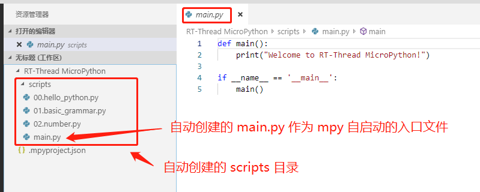
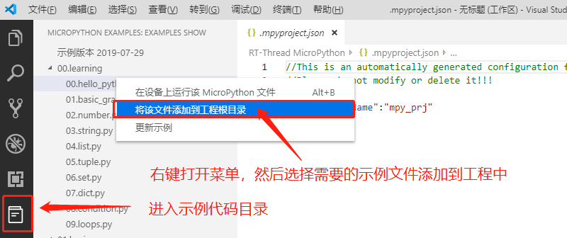
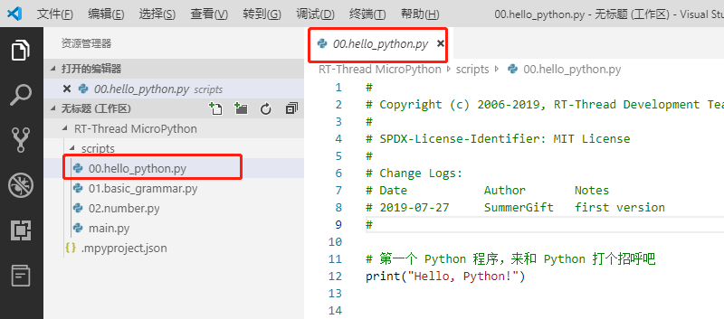

# MicroPython 开发指南

## MicroPython 固件介绍

MicroPython 固件指的是可以运行在特定板卡上，并且已经对该板卡做了 MicroPython 适配的固件程序。在这里适配的意思是，对 MicroPython 进行配置修改后，开发者可以通过编写 Python 程序来控制板卡上的硬件资源。 

MicroPython 固件可以从 RT-Thread 官方直接获取，目前功能支持比较完备的是 IoT Board 潘多拉开发板，固件下载地址如下：

```
https://github.com/RT-Thread/IoT_Board/tree/master/examples/31_micropython
```

如果想要 DIY 属于自己的专属固件，也非常简单。只需要在 RT-Thread 工程中开启 MicroPython 软件包即可，详细的制作方式可以通过阅读 [《MicroPython 固件开发指南》]() 深入了解。

通过以上两种方式之一获取固件，然后将 MicroPython 固件烧录到板卡之后，就可以使用 RT-Thread 推出的 MicroPython 开发环境来进行应用开发了。 

## MicroPython 开发环境使用介绍

RT-Thread 为广大开发者提供了[ **VSCode 最好用的 MicroPython 插件**](https://marketplace.visualstudio.com/items?itemName=RT-Thread.rt-thread-micropython) 来帮助大家使用 MicroPython 来开发应用程序。该插件为 MicroPython 开发提供了功能强大的开发环境，主要特性如下：

- 支持串口、USB、或网络的方式连接开发板
- 支持通过网络连接远程调试
- 支持基于 MicroPython 的代码智能补全
- 支持 MicroPython REPL 交互环境
- 提供丰富的代码示例
- 支持自动同步工程代码
- 支持在设备上运行示例代码
- 支持运行代码片段功能
- 支持多款 MicroPython 开发板

### 准备工作

本插件依赖 Microsoft Python 插件，并且使用 Python 脚本，因此需要做如下准备：

1. 安装 Microsoft Python 插件

2. 按照 Python 插件的提示在 PC 上安装 Python3 并加入到系统环境变量中


如果在 PC 上已经安装过上述插件和程序，可以跳过此准备步骤。

### 创建一个 MicroPython 工程


### 连接开发板

可以通过多种方式与开发板建立连接，下图展示常用的串口连接方式。


### 运行示例程序

和开发板建立连接后，可以直接运行示例代码，并观察代码在开发板上的运行效果，如下图所示：


### 更多功能介绍

- 基于 MicroPython 的代码智能补全


- 支持运行代码片段


还有更多贴心实用的功能等你来探索。

### 注意事项

- 需要选择 PowerShell 作为默认终端
- 不要删除工程目录下的 `.mpyproject.json` 文件，该文件是 MicroPython 工程的配置文件

## MicroPython 工程详解

在 MicroPython 开发环境中，我们使用工程的形式来组织 MicroPython 源文件，接下来将会详细介绍 MicroPython 工程相关的概念。

### 工程结构介绍

在 **创建一个 MicroPython 工程** 小节中，我们通过点击创建工程按钮，选择了一个文件夹作为 MicroPython 工程的根目录。此时 MicroPython 插件会默认在该目录下创建工程相关目录，并添加 `main.py` 文件，如下图所示：



- `scripts` 文件夹用于存放 MicroPython 脚本文件
- `.mpyproject.json` 是自动生成的工程的配置文件

### 向工程中添加示例代码

可以在示例程序中选择所需的文件添加到工程中，如下图所示：



此时可以在工程中看到已经添加到工程中的 hello_python.py 文件：



- 添加库到工程中

### 工程同步方式介绍
- 文件同步的策略
- 工程中文件的引用关系讲解

### 开机自动运行 main.py
- 讲述 main.py 的作用

