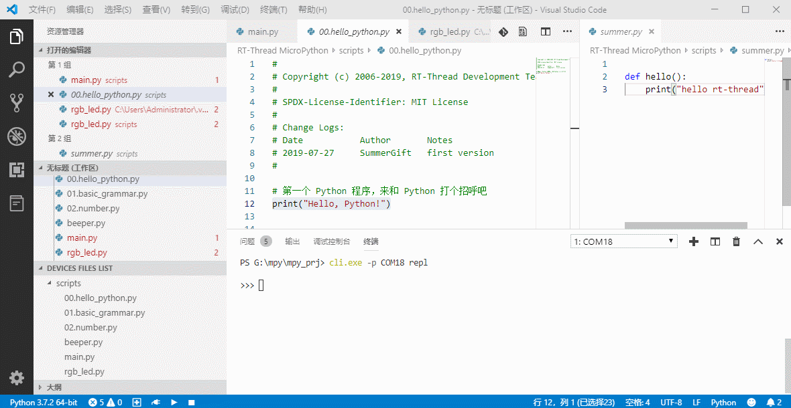
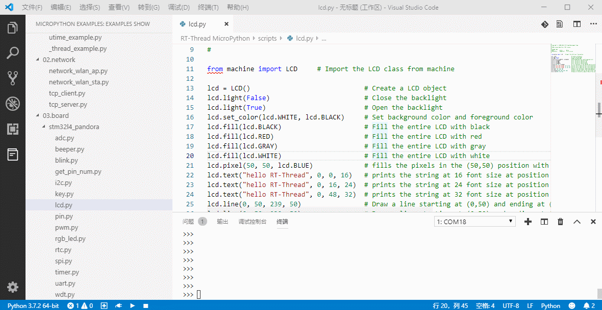
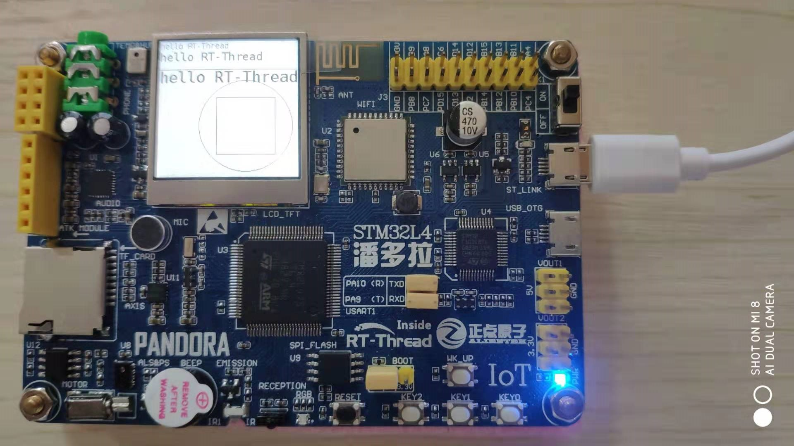
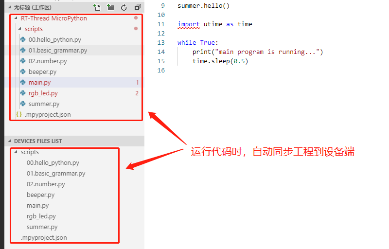

# 最好用的 MicroPython 开发环境来咯！！!

## 背景故事

随着半导体技术的飞速发展，硬件的处理和存储性能对程序的限制越来越弱，对开发者来说程序开发的效率被放在了越来越重要的位置。随着 Python 语言的逐渐成熟，它的运行速度、可靠性，以及效率大大满足了开发者对程序开发的需求，无论在任何环境下使用或者部署 Python，只会有可忽略不计的性能损失。

而在嵌入式领域，由于有了 Damien George 的伟大贡献 MicroPython，我们得以在微控制器编程上使用 Python 语言。凭借 MicroPython 极简风格的编程语法，使得硬件开发变得通俗易懂，大量的封装库方便极客们快速地开发原型设计。

MicroPython 的到来为嵌入式开发提供了新的可能，同时带来了新的开发方式，你将会体会到下列优点：

- 入门简单，学习容易
- 编程高效，快速应用
- 降低代码量，降低代码复杂度
- 调试简单，可通过异常打印快速得知错误位置
- 通过各种库轻松实现连接云端等高级功能
- 嵌入式开发者可以通过示例程序学习 Python 语言
- 高级语言开发者可以在不接触底层编程的情况下控制硬件

为了能让广大开发者能充分体验到 MicroPython 带来的便利性和优越性，RT-Thread 推出了 [**最好用的 MicroPython 开发环境**](https://marketplace.visualstudio.com/items?itemName=RT-Thread.rt-thread-micropython) 来帮助大家通过 MicroPython 进行项目开发。

## 功能示例

RT-Thread MicroPython 开发环境十分强大，它到底能提供什么样的功能呢，让我们一起来看一看：

- 支持串口、USB 、网络的方式连接开发板

  

- 灵活使用的 MicroPython REPL 交互环境

  

- 支持基于 MicroPython 的代码智能补全

  

- 提供丰富的代码示例

  
  
- 支持直接在设备上运行示例代码

  
  
  在潘多拉开发板上运行 LCD 控制示例：
  
  
  
  潘多拉开发板上的运行效果：
  
  

- 支持运行选中的代码片段

  

- 点击运行按钮自动同步工程代码

  

## 获取方式及使用方法

接下来可以通过阅读《MicroPython IDE 用户指南》来了解开发环境的详细使用方式，快来动手试一试吧。

## 相关文档

MicroPython 开发指南

MicroPython 固件开发指南