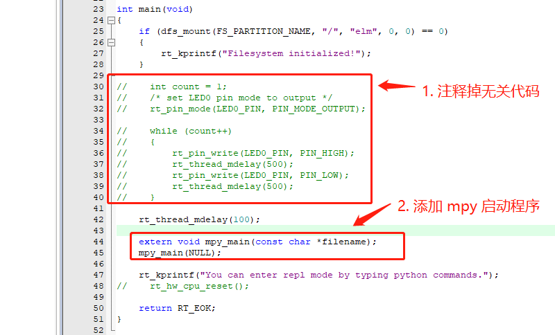

## DIY 属于你的 MicroPython 固件 

如果手上没有官方支持固件的开发板，就需要自己来动手制作 MicroPython 固件了。由于 RT-Thread 官方提供了 MicroPython 软件包，并且 MicroPython 底层和硬件绑定时对接了 RT-Thread 驱动框架，所以我们可以很方便地在运行了 RT-Thread 的板卡上将  MicroPython 跑起来。

接下来我们以 `rt-thread\bsp\stm32\stm32f407-atk-explorer` 为例，讲解如何在 BSP 的基础上制作 MicroPython 固件。

### 获取 MicroPython 软件包

使用 env 工具获取 MicroPython 软件包。

### 在 main 线程中启动 MicroPython

在 main 线程的执行函数中添加 MicroPython 的启动函数。

### 增大 main 线程栈

为了能正常运行 MicroPython，需要增大 main 线程的栈大小，这里我们将栈大小增加到 8k。

### 配置 MicroPython 运行环境堆大小

接下来需要根据板卡实际剩余 RAM 的情况来给 MicroPython 运行环境分配运行时内存，这里填写的数值越大，就能运行更多代码量的 Python 程序。在本次示例中，由于 RAM 剩余充足，我们在此填写 70k。如果这里填写的数值过大，可能会出现无法分配内存而报错，所以在配置此项目之前，需要对系统 RAM 资源的使用情况有一定了解。

### 在根目录挂载文件系统

最后要确保系统中 `/` 目录挂载了文件系统，有了文件系统，我们后续才能使用 [ **MicroPython 开发环境**](https://marketplace.visualstudio.com/items?itemName=RT-Thread.rt-thread-micropython) 将 Python 代码文件同步到板卡中来运行。关于挂载文件系统的相关内容，可以参考[文件系统相关文档](https://www.rt-thread.org/document/site/programming-manual/filesystem/filesystem/)进行配置。

进行了上述配置之后，使用 env 工具重新生成工程， 就可以获得所需的 MicroPython 固件了。

