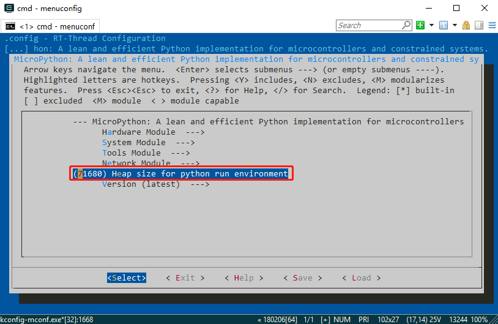
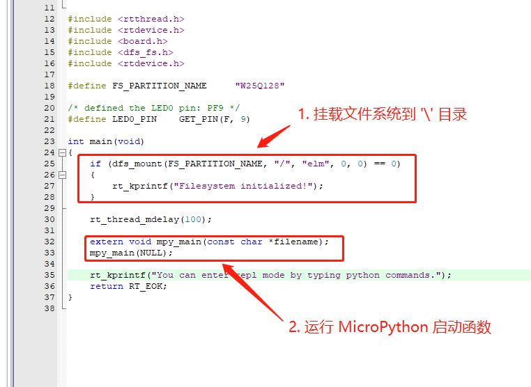

## DIY 属于你的 MicroPython 固件 

如果手上没有官方支持固件的开发板，就需要自己来动手制作 MicroPython 固件了。由于 RT-Thread 官方提供了 MicroPython 软件包，并且 MicroPython 底层和硬件绑定时对接了 RT-Thread 驱动框架，所以我们可以很方便地在运行了 RT-Thread 的板卡上将  MicroPython 跑起来。

接下来我们以 `rt-thread\bsp\stm32\stm32f407-atk-explorer` 为例，讲解如何在 BSP 的基础上制作 MicroPython 固件。

### 获取 MicroPython 软件包

先使用 `pkgs --upgrade` 命令更新软件包列表，然后通过 env 工具获取 MicroPython 软件包。

### 增大 main 线程栈

为了能正常运行 MicroPython，需要增大 main 线程的栈大小，这里我们将栈大小增加到 8k。

### 配置 MicroPython 运行环境堆大小

接下来需要根据板卡实际剩余 RAM 的情况来给 MicroPython 运行环境分配运行时内存，这里填写的数值越大，就能运行更多代码量的 Python 程序。在本次示例中，由于 RAM 剩余充足，我们在此填写 70k。

如果这里填写的数值过大，可能会出现无法分配内存而报错。所以在配置此项目之前，可以先通过 `msh` 的 `free` 命令来查看内存使用情况，对系统 RAM 资源的使用情况有一定了解。

### 在根目录挂载文件系统

最后要确保系统中 `/` 目录挂载了文件系统，有了文件系统，我们后续才能使用 [ **MicroPython 开发环境**](https://marketplace.visualstudio.com/items?itemName=RT-Thread.rt-thread-micropython) 将 Python 代码文件同步到板卡中来运行。本次示例中，我们配置使用 elm-fat 文件系统。如果对文件系统相关概念有疑问，可以参考 [文件系统说明文档](https://www.rt-thread.org/document/site/programming-manual/filesystem/filesystem/) 进行配置。

配置完成后，记得要使用 env 工具重新生成工程，使配置生效。

### 修改 main 线程启动代码

在 main 线程中需要做两件事：

- 挂载文件系统到 `\` 目录
- 在 main 线程中启动 MicroPython

修改 main 线程的代码如下图所示：

重新编译工程，并下载到板卡中，就会在 main() 线程中自动进入 MicroPython 的交互环境 REPL。此时如果先前没有在存储器上创建相应的文件系统，可能会导致文件系统挂载失败。此时可以使用如下两种方法在存储设备上创建文件系统：

- 按下 `CTRL + D` 进入 msh 使用 `mkfs -t elm W25Q128` 命令创建文件系统
- 在 REPL 交互环境中输入 `import os`，`os.mkfs("elm", "W25Q128")` 命令来创建文件系统

成功创建文件系统后，就可以使用 [ **MicroPython 开发环境**](https://marketplace.visualstudio.com/items?itemName=RT-Thread.rt-thread-micropython) 来进行应用开发了。

